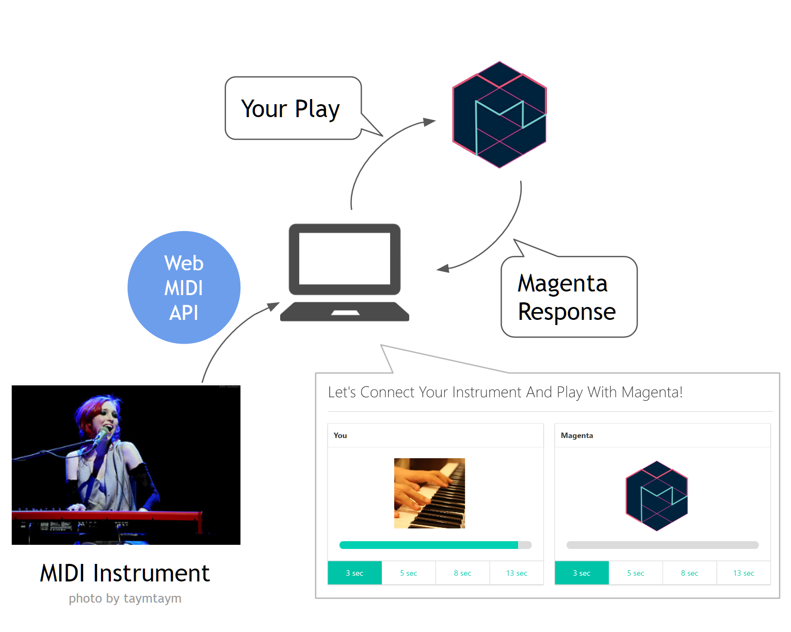
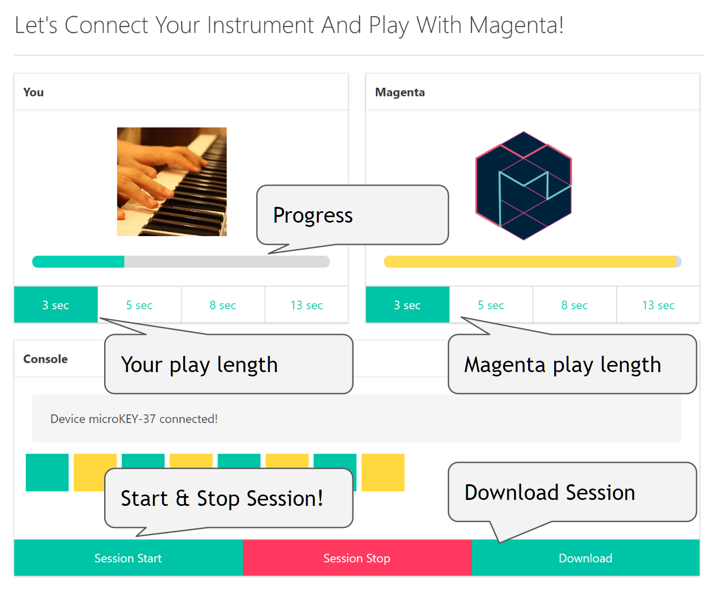
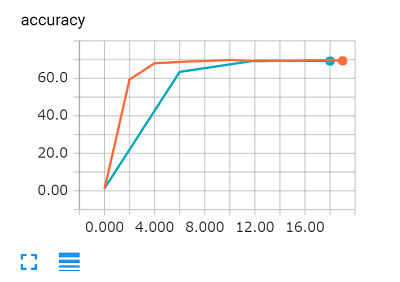

# magenta session

The code to session with [magenta](https://github.com/tensorflow/magenta).  
Do you have any MIDI instrument? If then, you can do call & response with magenta!  
(You don't have such instruments? Of course, you can play this without it!)

**You can see the sample play from here**

* [Playing Video](https://youtu.be/owOI2CMavoE)
* [Recorded Session](https://soundcloud.com/icoxfog417/magenta-sessioned-track)

(Sorry about my poor keyboard play!)

You can deploy your own Magenta Session to Heroku by following button.

[](https://heroku.com/deploy)

## Architecture



The model is ported from [ai-duet](https://github.com/googlecreativelab/aiexperiments-ai-duet).

## How to use

1. Install `magenta_session`
2. Run `python server/server.py`
3. Access the [Server(localhost:8080)](http://localhost:8080)
4. Session Now! (please refer following image).




## Install 

`magenta_session` depends on TensorFlow and magenta.  
Please refer [magenta installation guide](https://github.com/tensorflow/magenta#installation).

### Miniconda

Install the [Miniconda](https://conda.io/miniconda.html) (Miniconda3 is also ok), and create the Magenta environment.

```
conda create -n magenta numpy scipy matplotlib jupyter 
```

(If you use Miniconda3, please set `python=2.7` additionaly when create magenta environment. Because Magenta only works on Python2!)

Then activate the `magenta` environment, and install the dependencies.

```
source activate magenta
pip install -r requirements.txt
```

**CAUTION**

* `pyenv` user will have the trouble with `source activate magenta`. To avoid this, configure your environment by `pyenv versions`, and use `pyenv local` to set the magenta environment that you created.
* `TensorFlow` does not support Windows except the Python3.5 version (and Magenta does not work on Python3.5!). So If you want to run it on Windows, you have to use [bash on Windows](https://msdn.microsoft.com/en-us/commandline/wsl/install_guide).


### Docker

Docker is an open-source containerization software which simplifies installation across various OSes.Once you have Docker installed, you can just run:

```bash
$ docker run -it --rm -p 80:8080 asashiho/magenta_session
```

If you want to build DockerImage yourself, you can just run:

```bash
$ docker build -t magenta_session .
$ docker run -it --rm -p 80:8080 magenta-session
```
**Tips!** Docker to automatically clean up the container and remove the file system when the container exits, you can add the `--rm`

You can now play with `magenta_session` at `http://<docker-server-ipaddress>/`.


Session Now and Enjoy Music!

## Train your own model

You can create your own model by your MIDI files!
The procedure is almost same as [MelodyRNN](https://github.com/tensorflow/magenta/tree/master/magenta/models/melody_rnn). So please refer it as you need.

### 1. Prepare the MIDI data

Please gather your favorite MIDI files and store it to `data/raw`. You can find the MIDI files from following sites.

* [midiworld.com](http://www.midiworld.com/files/142/)
* [FreeMIDI.org](https://freemidi.org/)
* [The Lakh MIDI Dataset v0.1](http://colinraffel.com/projects/lmd/)

Game Music

* [Video Game Music Archive](http://www.vgmusic.com/)
* [THE MIDI SHRINE](http://www.midishrine.com/)

### 2. Create the NoteSequence from MIDI files.

Run the following command to convert the MIDI files to `NoteSequence`.

```
python scripts/data/create_note_sequences.py
```

Then, you can find `notesequences.tfrecord` in the `data/interim` folder.

### 3. Convert the NoteSequence to Dataset for Model

We mainly use [`MelodyRNN`](https://github.com/tensorflow/magenta/tree/master/magenta/models/melody_rnn#melody-rnn), So convert the Notesequence by its dataset script.

You have to specify what kinds of model do you use by `--config` argument.

* basic_rnn
* lookback_rnn
* attention_rnn

```
python scripts/data/convert_to_melody_dataset.py  --config attention_rnn
```

At the same time, dataset is splited to training and evaluation. You can specify its rate by `--eval_ratio` (default is `0.1`).

### 4. Training the Model

If dataset is prepared, you can begin the training!  
Run the `train_model.py` and specify the model parameters like following.

```
python scripts/models/train_model.py --config attention_rnn --hparams="{'batch_size':64,'rnn_layer_sizes':[64,64]}" --num_training_steps=20000
```

([parameter is almost same as original](https://github.com/tensorflow/magenta/tree/master/magenta/models/melody_rnn#train-and-evaluate-the-model))

You can watch the training state by TensorBoard.  
Run the evaluation script...

```
python scripts/models/train_model.py --config attention_rnn --hparams="{'batch_size':64,'rnn_layer_sizes':[64,64]}" --num_training_steps=20000 --eval
```

Then invoke the TensorBoard and access [`http://localhost:6006`](http://localhost:6006).

```
tensorboard --logdir=models/logdir
```



### 5. Create the Model

After the training, then create your own model file.

```
python scripts/models/create_bundle.py --bundle_file my_model
```

Then, your model is stored in `models/` directory!

### 6. Generate the MIDI files

Now, let's try to generate the MIDI file! You can do it by below script.

```
python scripts/models/generate_midi.py --bundle_file=my_model --num_outputs=10 --num_steps=128 --primer_melody="[60]"
```

([parameter is almost same as original](https://github.com/tensorflow/magenta/tree/master/magenta/models/melody_rnn#generate-a-melody))

If it is succeeded, MIDI files will be stored at `data/generated` directory. Sounds Good? Enjoy!


### 7. Session with Your Model

I think you want to session with your own Musical Model! 
If so, set the `MAGENTA_MODEL` environmental variable.

```
export MAGENTA_MODEL=my_model
```

Then startup **magenta session server**!

```
python server/server.py
```

You can play the Call & Response with your model!

## Dependencies

Python

* [magenta](https://github.com/tensorflow/magenta)
* [TensorFlow](https://github.com/tensorflow/tensorflow)
* [Flask](https://github.com/pallets/flask)

JavaScript

* [Tone.js](https://github.com/Tonejs/Tone.js)
* [MidiConvert](https://github.com/Tonejs/MidiConvert)
* [jQuery](https://github.com/jquery/jquery) (It's enough to such a simple application)

CSS

* [Bulma](http://bulma.io/)
